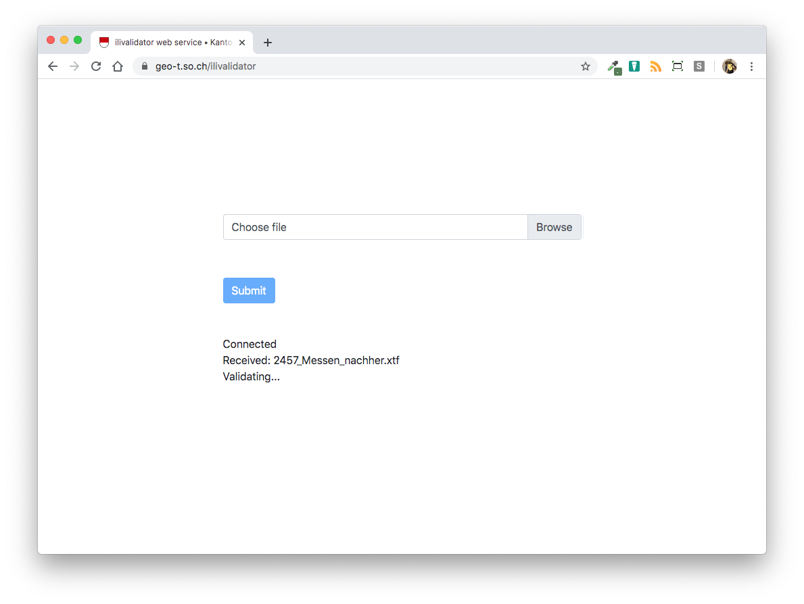

================
Benutzerhandbuch
================

Bedienung des Webservices
=========================

Der *ilivalidator web service* stellt eine einfache Art dar INTERLIS-Daten gegenüber einem INTERLIS-Modell  zu prüfen (= Modellkonformität). Die zu prüfenden INTERLIS-Daten werden mittels Webformular auf einen Server hochgeladen, wo sie anschliessend automatisch geprüft werden. Das Prüfresultat_ wird direkt im Browser angezeigt. 

Beim Aufruf des *ilivalidator web services* erscheint folgendes Webformular:

.. image:: images/ilivalidator01.png

Die zu prüfende Datei kann durch Knopfdruck auf "DURCHSUCHEN" ausgewählt werden. Die Datei darf *nicht* gezippt sein.

.. image:: images/ilivalidator02.png

Im Feld "INTERLIS-Transferdatei" erscheint neu der Name der ausgewählten Datei.

.. image:: images/ilivalidator03.png

Die Validierung kann durch Knopfdruck auf "HOCHLADEN" gestartet werden. Der Knopf verändert die Farbe von rot nach grau und es können keine weiteren Aktionen auf der Webseite vorgenommen werden:



Die Prüfung kann - je nach Grösse der Datei resp. des Dateiinhaltes - ein paar Sekunden bis zu einigen Minuten dauern. Das Prüfresultat wird direkt im Browser dargestellt:

.. image:: images/ilivalidator05.png

Der Output des Webservices scheint auf den ersten Blick unübersichtlich. Er wird detailliert im nächsten Kapitel erläutert. Befindet sich am Ende ``Info: ...validation done``, hat der Webservice keine Fehler gefunden.

Mit dem Back-Button des Browsers kann eine neue Validierung gestartet werden.

Interpretation der Resultate
============================

.. _Prüfresultat:

Im Output des Webservices stehen in der Regel viele Zeilen, die mit ``Info:`` beginnen. Dabei handelt es sich um reine Informationen, die für die allfällige Suche nach Fehlern resp. Interpretation eines Fehlers nicht relevant sind. Die letzte Zeile des Outputs der Prüfung zeigt, ob der Validator einen Fehler in der INTERLIS-Transferdatei gefunden hat. Steht ``Info: ...validation failed`` anstelle von ``Info: ...validation done`` als letzte Zeile im Output, wurden Fehler entdeckt. Informationen zu diesen Fehlern stehen ebenfalls im Output in den Zeilen, die mit ``Error:`` beginnen. Nachfolgend werden einige typische Fehlerbeispiele anhand eines `kantonalen Datenmodelles <http://geo.so.ch/models/ARP/SO_Nutzungsplanung_20170105.ili>`_ erläutert.

Allgemeine Hinweise
-------------------

Ein entdeckter Fehler wird im Ouput mit ``Error:`` ausgewiesen. Dementsprechend kann einfach nach diesem Schlüsselwort gesucht werden. Ein einfaches Beispiel sieht so aus:

``Error: line 22: SO_Nutzungsplanung_20170105.Rechtsvorschriften.Dokument: tid d53a9b32-668f-4d07-a10e-ef60a568a722: Attribute OffizielleNr requires a value``

Nach ``Error:`` wird eine Zeilennummer angezeigt (z.B. ``line 22:``). Dabei handelt es sich nicht um die Zeilennummer auf der sich der Fehler genau befindet, sondern um die Zeilennumer auf der das INTERLIS-Objekt mit dem Fehler beginnt. Nach der Zeilennummer folgt der qualifizierte Attributname, z.B. ``SO_Nutzungsplanung_20170105.Rechtsvorschriften.Dokument`` (<Modellname>.<Topicname>.<Klassenname>). Nach dem qualifizierten Klassennamen folgt der Transferidentifikator des Objektes (``tid d53a9b32-668f-4d07-a10e-ef60a568a722:``). Werden im INTERLIS-Modell stabile Identifikatoren verlangt, können diese beim Auffinden des fehlerhaften Objektes im Erfassungssystem hilfreich sein. Als letzte Information folgt die eigentliche Fehlermeldung, z.B.: ``Attribute OffizielleNr requires a value``.


Fehlendes zwingendes Attribut
-----------------------------

``Attribute OffizielleNr requires a value``

Für das Attribut ``OffizielleNr`` müssen gemäss Modell (``OffizielleNr : MANDATORY TEXT*20;``
) zwingend Werte erfasst werden. 


Zu lange Attributwerte
----------------------

``Attribute DokumentID is length restricted to 16``

Das Attribut ``DokumentID`` darf höchstens 16 Zeichen (``DokumentID : TEXT*16;``) lang sein.


Falscher Wert eines Aufzähltyps
-------------------------------

``value AA is not a member of the enumeration```

Bei Aufzähltyp-Attributen dürfen nur bestimmte Werte eingetragen werden. Wurde ein falscher Wert eingetragen, erscheint eine Fehlermeldung.

Falsches Datum
--------------

``date value <92002-04-23> is not in range``

``date value <24-11-1981> is not in range``

Ein ganz grob falsches Datum oder ein falsch formatiertes Datum wird erkannt. 


Falscher BOOLEAN-Typ
--------------------

``value <richtig> is not a BOOLEAN```

Attribute vom Typ BOOLEAN müssen korrekt in der INTERLIS-Transferdatei codiert werden (``true`` resp. ``false``).


Falscher Wertebereich
---------------------

``value 10.40 is out of range``

In Wertebereichs-Attribute können nur Werte innerhalb eines bestimmten Bereichs gespeichert werden, z.B. ``Nutzungsziffer : 0.00 .. 9.00;``. Wurde ein zu hoher oder zu tiefer Wert abgespeichert, wird der Fehler erkannt.


Mehrfach verwendeter Objektidentifikator
----------------------------------------

``OID 12dd6ab7-8ed5-458a-a982-e1bf6e542c8c of object SO_Nutzungsplanung_20170105.Rechtsvorschriften.Dokument already exists in CLASS SO_Nutzungsplanung_20170105.Rechtsvorschriften.Dokument.``

Der Objektidentifikator muss in der INTERLIS-Transferdatei eindeutig sein. Wird der Objektidentifikator in einer anderen Klasse ein weiteres Mal verwendet, kann die Fehlermeldung nicht mehr ganz eindeutig sein (aufgrund von Folgefehlern).


Mehrfach verwendeter Basketidentifikator
----------------------------------------

``BID x123 of SO_Nutzungsplanung_20170105.Erschliessungsplanung already exists in SO_Nutzungsplanung_20170105.Rechtsvorschriften``

Basketidentifikatoren müssen in der INTERLIS-Transferdatei eindeutig sein.


Mehrfach verwendete UNIQUE-Werte
--------------------------------

``Unique is violated! Values 4300 already exist in Object: 68dcb08f-2939-4c1a-84fb-ea3def2272f6```

Attributewerte können in einer Klasse eindeutig sein (``UNIQUE Code_kommunal;``). Wird diese Bedingung verletzt, erscheint eine Fehlermeldung.


Verweis auf ein nicht-existierendes Objekt
------------------------------------------

``No object found with OID XXXX68dcb08f-2939-4c1a-84fb-ea3def2272f6 in basket SO_Nutzungsplanung_20170105.Nutzungsplanung.```

Wird in Assoziationen oder in Klassen auf Objekte verwiesen, die nicht existieren, erscheint eine Fehlermeldung.


TODO: validate multiplicity of role
-----------------------------------

Beispiel ``Grundnutzung -- {1..*} Grundnutzung``...

Nach Bugfixing ilivalidator (?)


TODO: validate target of role
----------------------------

Was macht das genau?


TODO: Fehlerhafte Flächenbildung (AREA-Bedingung)
-------------------------------------------------

``Fehlermeldung nach Bugfixing``

Falls im Modell eine überlappungsfreie Geometrie in einer Klasse vorgesehen ist (sogenannte AREA-Geometrie), wird ein Fehler erkannt, falls sich die einzelnen Geometrien dieser Klasse überlappen. Lücken sind technisch erlaubt, aber oftmals nicht gewünscht. Diese Lücken werden nicht erkannt.


Weitere Hinweise
================

Der *ilivalidator web service* basiert auf dem `ilivalidator-Projekt <https://github.com/claeis/ilivalidator>`_. Die Prüfung von INTERLIS-Daten kann dementsprechend auch ohne Webservice erfolgen. Für die Funktionsweise von *ilivalidator* wird auf die `Projektdokumentation <https://github.com/claeis/ilivalidator/blob/master/docs/ilivalidator.rst>`_ verwiesen. 

