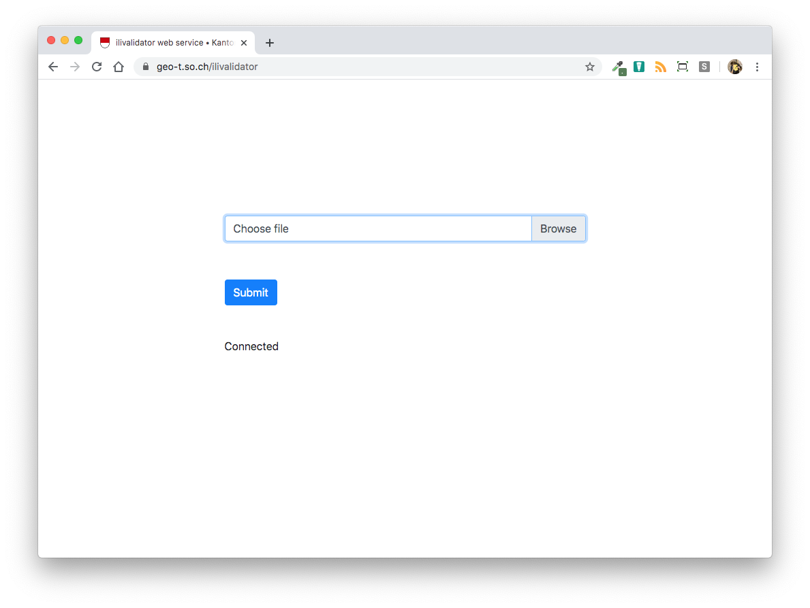
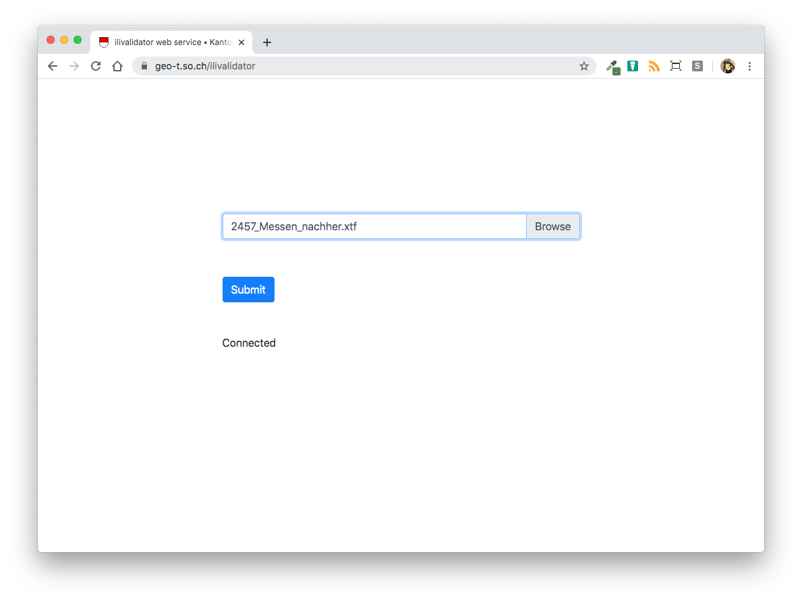

================
Benutzerhandbuch
================

Bedienung des Webservices
=========================

Der *ilivalidator web service* stellt eine einfache Art dar INTERLIS-Daten gegenüber einem INTERLIS-Modell  zu prüfen (= Modellkonformität). Die zu prüfenden INTERLIS-Daten werden mittels Webformular auf einen Server hochgeladen, wo sie anschliessend automatisch geprüft werden. Das Prüfresultat_ wird direkt im Browser angezeigt. 

Beim Aufruf des *ilivalidator web services* erscheint folgendes Webformular:

Die zu prüfende Datei kann durch Knopfdruck auf "DURCHSUCHEN" ausgewählt werden:

.. image:: images/ilivalidator02.png

Im Feld "INTERLIS-Transferdatei" erscheint neu der Name der ausgewählten Datei.

Die Validierung kann durch Knopfdruck auf "HOCHLADEN" gestartet werden. Der Knopf verändert die Farbe von rot nach grau und es können keine weiteren Aktionen auf der Webseite vorgenommen werden:

.. image:: images/ilivalidator04.png

Die Prüfung kann - je nach Grösse der Datei resp. des Dateiinhaltes - ein paar Sekunden bis zu einigen Minuten dauern. Das Prüfresultat wird direkt im Browser dargstellt:

.. image:: images/ilivalidator05.png

asdfasdf 

Ilivalidator ist ein in Java erstelltes Programm, das eine
Interlis-Transferdatei (itf oder xtf) gemäss einem Interlis-Modell entsprechend
(ili) überprüft.

Es bestehen u.a. folgende Konfigurationsmöglichkeiten:
- einzelne Prüfungen ein oder auszuschalten
- eigene Fehlermeldungen inkl. Attributwerte zu definieren
- zusätzliche Bedingung zu definieren
- zusätzliche INTERLIS-Funktionen zu implementieren

Laufzeitanforderungen
---------------------

Das Programm setzt Java 1.6 voraus.

Interpretation der Resultate
============================

.. _Prüfresultat:

asdfadf asdf asdf